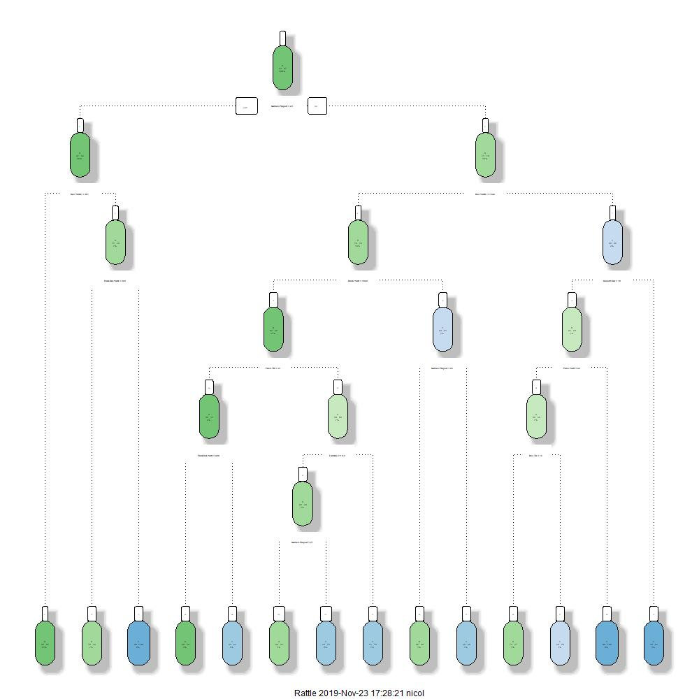

## Fundamentals of Classification Trees
Classification trees split the different variables in order to obtain the most homogeneos possible clusters, by minimizing a loss function, that can be restricted (this complexity parameter is called cp in the rpart-Package). For every split it computes the sum of the errors on both sides of the split for all Variables and chooses the one with the lowest error.

## Our Approach
As also applied in the other models, we use all the available information just before the 2014 NFL-Draft, in order to train the model and then apply it on the data for 2014. In other words we act as if it was the end of April 2014 (which is one week before the draft).

For growing trees on our College League / NFL Draft data, we check whether the best results can be optained, by manually splitting the data sets on the three postitions (QB / WR / RB) or if the computer will do that on his own. For growing the trees we use the rpart-Package, which is commonly used for this purpose, since it does very much on his own. When growing a tree it uses k-fold cross-validation (by default k=10) for optimizing the model with respect to the best complexity and the spots to split. Therefore we do no further cross-validation on the data set.

Here you can see the different trees, that we grew, plotted with the fancyRpartPlot-function out of the rattle-Package. Since we use data with many variables and a couple of splits are made, the plots are not really readable. The aim of showing them, is to visualize the complexity of the trees.

