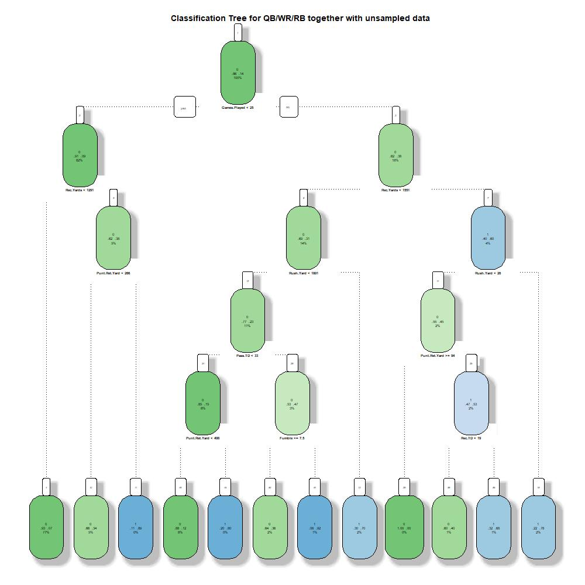
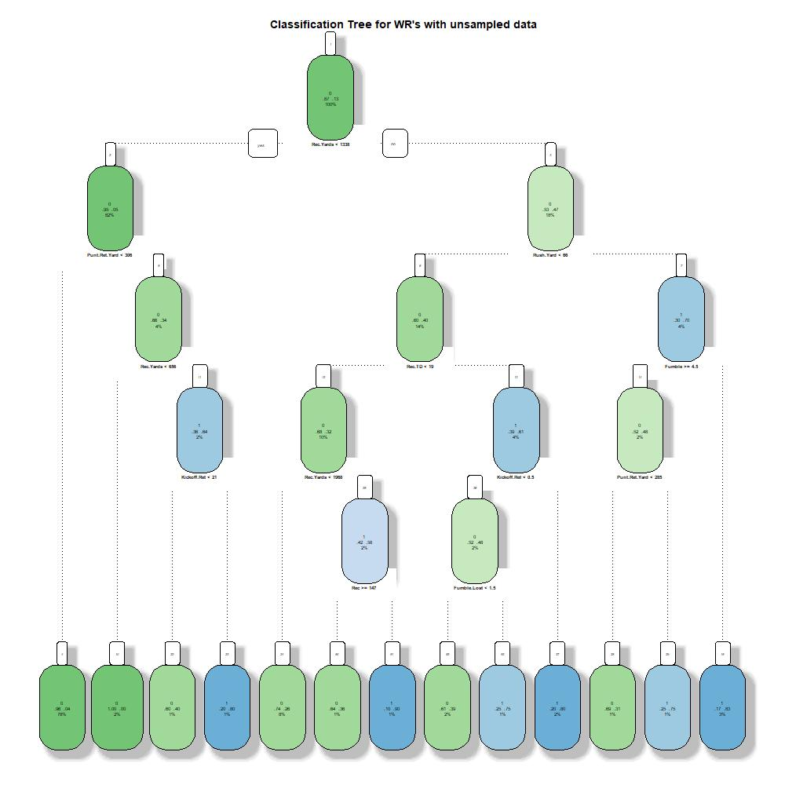

## Fundamentals of Classification Trees
Classification trees split the different variables in order to obtain the most homogeneos possible clusters, by minimizing a loss function, that can be restricted (this complexity parameter is called 'cp' in the rpart-Package). For every split it computes the sum of the errors on both sides of the split for all Variables and chooses the one with the lowest error.

## Our Approach
As also applied in the other models, we use all the available information just before the 2014 NFL-Draft, in order to train the model and then apply it on the data for 2014. In other words we act as if it was the end of April 2014 (which is one week before the draft).

For growing trees on our College League / NFL Draft data, we check whether the best results can be optained, by manually splitting the data sets on the three postitions (QB / WR / RB) or if the computer will do that on his own. For growing the trees we use the rpart-Package, which is commonly used for this purpose, since it does very much on his own. When growing a tree it uses k-fold cross-validation (by default k=10) for optimizing the model with respect to the best complexity and the spots to split. Therefore we do no further cross-validation on the data set.


You can see the different trees, that we grew, plotted with the fancyRpartPlot-function out of the rattle-Package in the Appendix at the end of this file. We are cross-validating the sampling methods and therefore grow 20 trees in total, we will still just display the four trees from the unsampled dataframe. Since we use data with many variables and a couple of splits are made, the plots are not really readable. The aim of showing them, is to visualize the complexity of the trees.

## Performance Measurement of the trees
We now want to have a look on the performance of the trees. In order to compare the results to other models performance, we decided to always take unsampled data for this. And since our business case is to predict the 2014 draft (as if it was the day before), we apply it on the data from 2007 to 2013 to compare the classification errors.
```{r, include=FALSE}
library(tidyverse)
load("../PerformanceMeasurement/ClassificationTreePerfMeas.Rdata")
ClassificationTreePerfMeas1 = ClassificationTreePerfMeas %>%
  select(-c(Method, Sampling))
PerfMeas = as.data.frame(t(ClassificationTreePerfMeas1))
names(PerfMeas) = c("No Sampling", "Oversampling", "Undersampling", "Rose Both", "Smote")
PerfMeasPerc = data.frame(Sampling = ClassificationTreePerfMeas$Sampling, QB = NA, WR = NA, RB = NA, Together = NA, stringsAsFactors = FALSE)
for(i in 1:nrow(ClassificationTreePerfMeas)){
  PerfMeasPerc$QB[i] = (ClassificationTreePerfMeas$QB_TP[i] + ClassificationTreePerfMeas$QB_TN[i])/(ClassificationTreePerfMeas$QB_TP[i] + ClassificationTreePerfMeas$QB_TN[i] + ClassificationTreePerfMeas$QB_FN[i] + ClassificationTreePerfMeas$QB_FP[i])
  PerfMeasPerc$WR[i] = (ClassificationTreePerfMeas$WR_TP[i] + ClassificationTreePerfMeas$WR_TN[i])/(ClassificationTreePerfMeas$WR_TP[i] + ClassificationTreePerfMeas$WR_TN[i] + ClassificationTreePerfMeas$WR_FN[i] + ClassificationTreePerfMeas$WR_FP[i])
  PerfMeasPerc$RB[i] = (ClassificationTreePerfMeas$RB_TP[i] + ClassificationTreePerfMeas$RB_TN[i])/(ClassificationTreePerfMeas$RB_TP[i] + ClassificationTreePerfMeas$RB_TN[i] + ClassificationTreePerfMeas$RB_FN[i] + ClassificationTreePerfMeas$RB_FP[i])
  PerfMeasPerc$Together[i] = (ClassificationTreePerfMeas$Together_TP[i] + ClassificationTreePerfMeas$Together_TN[i])/(ClassificationTreePerfMeas$Together_TP[i] + ClassificationTreePerfMeas$Together_TN[i] + ClassificationTreePerfMeas$Together_FN[i] + ClassificationTreePerfMeas$Together_FP[i])
}

```

```{r echo = FALSE}
knitr::kable(PerfMeas, caption = "True Positives/Negatives and False Positives/Negatives of the trees for the different models")
```

In order to compare them better, we will now have a look at the ratio of correct classification, which is equal to:

\begin{center}
$\frac{Correct Classifications}{All Classifications} = \frac{TP + TN}{TP+TP+FP+FN}$
\end{center}


```{r echo = FALSE}
knitr::kable(PerfMeasPerc, caption = "Percentage of right classifications", digits=4)
```

## Conclusion
As we see, the models for the manually separated positions mostly perform better than the model for QB/WR/RB together. But the bigger effect, which we can see, is that the sampling reduces the accuracy of the models quite much. Since we have 12.4% of drafted players in the data, a model predicting 0 (=not drafted) would outperform the models trained on sampled data.

Within the Classification tree models, the highest accuracy could be obtained, by using the three models for the manually separated positions with a weighted average accuracy of 91.74%. Keeping in mind, that a model that always predicts '0' would also have an accuracy of 87.6%, this models performance, which looks very good on the first sight, is only a quite small improvement.


## Appendix

{#id .class width=50%}

{#id .class width=50%}

{#id .class width=50%}

{#id .class width=50%}
