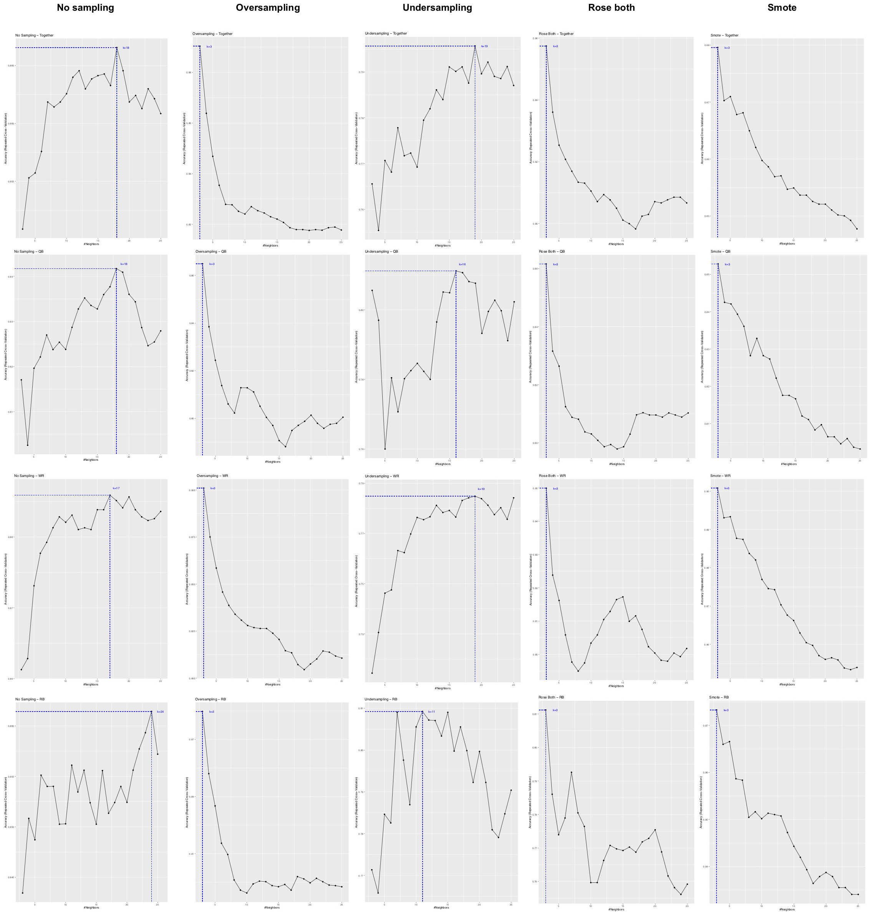

**Corresponding R Script:** [KNN](https://github.com/NicSchuler/DSF_NFLDraftPrediction/tree/master/Project_Scripts)

# 1. Introduction

There are two classes of college football players (CFPs); drafted and not drafted to the NFL. A CFP-profile consists of different features $x_{1} ... x_{n}$. To estimate whether a new CFP will be drafted to the NFL or not, for a new CFP-profiles' features we use K-nearest neighbor (KNN) algorithm to determine that. KNN is a an algorithm that predictes each observation based on its “similarity” to other observations. The algorithm is memory based, beacuse the part of "learning" consists of simply storing the training examples, which is also called lazy learning.

# 2. Majority Decision and Euclidean Distance

KNN measures similarity in the sense that it identifies $k$ observations that are nearest to the new CFP-profile's features and then uses in our context (since we classify CFPs), the most common class of those $k$ observations as the predicted output. The classification is then based on a majority decision, in which the above mentioned $k$ next - already classified - objects participate. For two classes, as in our case, a tie in the majority decision can be prevented by the choice of an odd $k$.

In order to determine the similarity between observations a distance metric is used to compute the pairwise differences between the observations. The most common distance measure is the Euclidean distance metric, which is used in our case. It should be noted that other common used distance measures also exist, such as Manhatten or Minkowski, which are not used in the present case. The Euclidean measures the straight-line distance between two observations $x_{a}$ and $x_{b}$ for all $n$ features:

$$\sqrt{\sum_{n=1}^{P} (x_{an}-x_{bn})^2}$$
  
# 3. Data Standardization

Due to the squaring, the Euclidean distance is sensitive to outliers and furthermore to the scale of the features. Features that have different scales will bias the distance measures as those predictors with the large values will contribute most to the distance between two features. Due to the possible differences between magnitudes of features' values, we standardize the data. As we will show in Chapter 5 we use the z-score, which is a common method to standardize the data. From each feature value we substract the mean and divide by standard deviation:

$$z=\frac{(x-\mu)}{\sigma}$$

The z-score is the number of standard deviations a score is above or below the mean. Since we have only numeric features and no categorical for prediction, see [RM.DataHandling](https://github.com/NicSchuler/DSF_NFLDraftPrediction/tree/master/Data/READMEs), we do not have to apply methods such as one-hote encoding to represent categorical features numerically.

# 5. Implementation in R-Studio

The application of KNN in R Studio is explained below. If individual code sections are analyzed in more detail, the code for the category `_tog` is shown as an example. The shown code is also representative for the categories `_QB`, `_RB` and `_WR`.

## 5.1 Training KNN Models with 10-fold Cross Validation

For training we use the corresponding data from the years 2007 to 2013 with respect to the unsampled and sampled datasets. We train KNN models with 10-fold cross validation and therefore use the package `caret`, which is generally used for classification and regression training. By using `train()` we evaluate the accuracy of the KNN classifiers with different values of $k$ by 10-fold cross validation. 

With `expand.grid()` we also provide a tuning grid for the values of $k$. The function`expand.grid()` returns a data frame, which the `tuneGrid` argument expects. The KNN parameter $k$ can then be tuned with the argument `tuneGrid`. By setting `k = seq(3, 25, by = 1)` the function `train()` will try all $k$ (integer) values between 3 and 25 to determine $k$ for the KNN model, which optimizes accuracy by 10-fold cross validation.

```
tr_control <- trainControl(method="repeatedcv", number=10, repeats = 3)
hyper_grid <- expand.grid(k = seq(3, 25, by = 1))

set.seed(6969)
KNN_tog <- train(Drafted~., 
             data=Data2007to2013_tog,
             method="knn",
             trControl=tr_control,
             preProcess=c("center","scale"),
             tuneGrid=hyper_grid) 

```
For the probability cutoff value 0.5 is used by default in the following code. Further we store the predictions in a Checklist. What we later do with the checklist is described in the script [KNN](https://github.com/NicSchuler/DSF_NFLDraftPrediction/tree/master/Project_Scripts).

```
predict_tog <- predict(KNN_tog,Data2007to2013_tog) 
CheckList_tog = cbind.data.frame(Data2007to2013_tog$Drafted,predict_tog)

```
 
## 5.2 Choosing $k$

The following plots records the cross validated results for the respecitve training data and positions, where (integer) values between 3 and 25 are assessed for $k$. (For better resolution, see the script [KNN](https://github.com/NicSchuler/DSF_NFLDraftPrediction/tree/master/Project_Scripts).)




The performance of the models is sensitive to the choice of $k$. With low values for $k$ a model typically overfits and for large values the model often underfits. At the extremes, when $k=1$, we would base the prediction on a single observation that has the closest distance measure. On the other hand, when $k=n$, we would simply be using the most common class, in our context not drafted CFP, across all training samples as our predicted value. There is no general rule existent about the optimal $k$; it depends on the nature of the data. For high signal data with few noisy, respectively irrelevant features, smaller values of $k$ tend to work best. As more irrelevant features are present, larger values of $k$ are required to smooth out the noise. The k values values received in our case are listed in a tables below:

\newpage

```{r, include=FALSE}
library(tidyverse)
load("RM_KNN_files/KNN_K.Rdata")
```
```{r echo = FALSE}
knitr::kable(KNN_K, caption = "k Values for KNN Models")
```

In our case the following may be possible. In our context are a lot of different features considered in the models. All these features are also considered regarding the individual player positions `_QB`, `_RB` and `_WR`, whereas from an objective point of view all these features do not always seem suitable to measure their position specific performance. Therefore a larger value could be used to smooth out the noise. On the other hand, there are strong correlations between many variables, as can be seen in the [ReadMe](https://github.com/NicSchuler/DSF_NFLDraftPrediction/tree/master/Data/READMEs) and [Script](https://github.com/NicSchuler/DSF_NFLDraftPrediction/tree/master/Project_Scripts) for the Naive Bayes classifier. If these variables are good indicators, they can reinforce each other and would determine the classification relatively more strongly; this would indicate a rather lower $k$ value.

These questions do not need to be addressed further in our case. Due to our research question, only the most optimal model is tested with the data from 2014 and, in particular, there is no focus on the topic of "variable importance" here. Thus, statements about the determination of an optimal $k$ value and its interpretation represent starting points for further projects.
