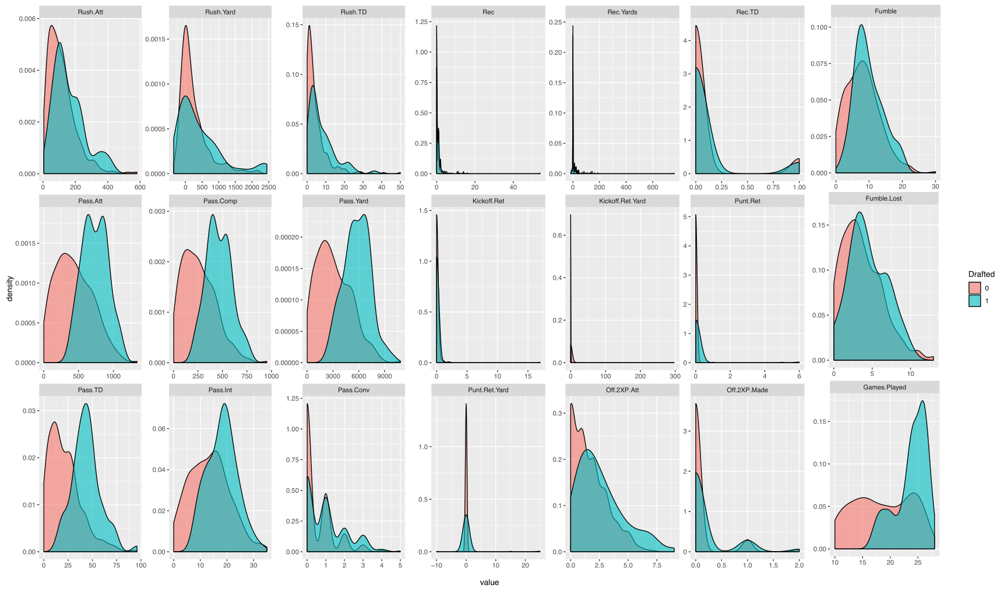
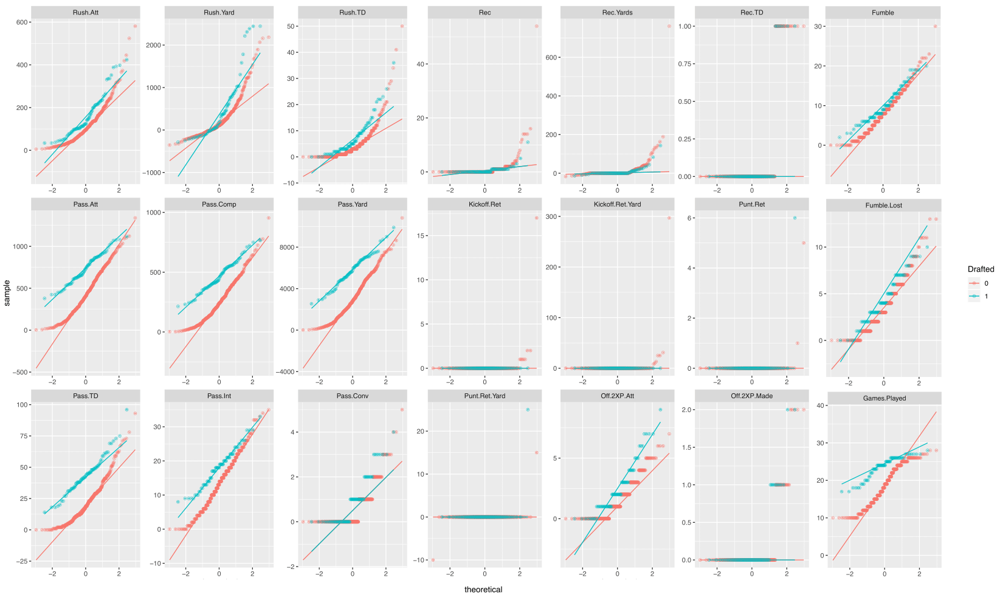
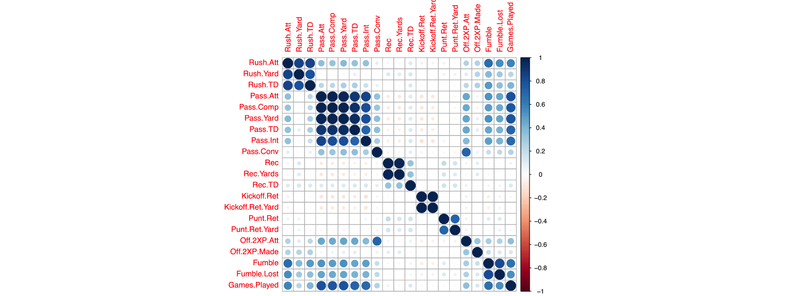

**Corresponding R Script:** [NaïveBayes](https://github.com/NicSchuler/DSF_NFLDraftPrediction/tree/master/Project_Scripts)

# 1. Introduction

There are two classes of college football players (CFPs) $C_{k \in \{1,2\}} =\{D, \bar{D} \}$; drafted and not drafted to the NFL. A CFP-profile consists of different features $x_{1} ... x_{n}$. To estimate whether a new CFP will be drafted to the NFL or not, for a new CFP-profiles' features the following question has to be answered: Is the probability of $P(D\mid X)$ - the probability that the CFP will be drafted to the NFL given the features $x_{i},...,x_{n}$ - larger or smaller than the probability of $P(\bar{D}\mid X)$ - the probability that the CFP will not be drafted to the NFL given the features $x_{i},...,x_{n}$? It follows that if $P(D\mid X) < P(\bar{D} \mid X)$ the new CFP-profile with the features $x_{i},...,x_{n}$ will be labeled as not drafted and vice versa.

# 2. Bayes Rule

To compute the probabilities $P(D\mid X)$ and $P(\bar{D} \mid X)$ Bayes Rule is applied. The conditional probability $P(C_{k}\mid X)$ is defined by:

$$P(C_{k}\mid X) = \frac{ P(C_{k}\cap X)}{P(X)}$$

By rewriting the conditional probabilities and equating both right-hand sides of these equation it follows that:

$$P(C_{k}\cap X)= P(C_{k}\mid X)P(X)$$

$$P(C_{k}\cap X)= P(X\mid C_{k})P(C_{k})$$
$$P(C_{k}\mid X) = \frac{P(X\mid C_{k})P(C_{k})}{P(X)}$$

Where $P(C_{k}\mid X)$ is the posterior probability, $P(X \mid C_{k})$ the likelihood, $P(C_{k})$ the prior probability of the class and $P(X)$ the prior probability of the features. In practice, there is interest only in the numerator of that fraction, because the denominator does not depend on $C_{k}$ and the values of the features $x_{i},...,x_{n}$ are given, so that the denominator is constant. The numerator is equivalent to the joint probability model $P(C_{k}, x_{1},...,x_{n})$.

# 3. Naïve Bayes

The following section explains how the numerator, the denuminator and finally the  the conditional distribution over the class variable $C_{k}$ are calculated in the sense of Naïve Bayes.

## 3.1 Compute the Numerator $P(X\mid C_{k})P(C_{k})$: Naïve Assumption

Using the chain-rule for repeated applications of the definition of conditional probability the numerator $P(X\mid C_{k})P(C_{k})$, respectively $P(C_{k}, x_{1},...,x_{n})$ can be decomposed as:

$$P(C_{k}, x_{1},...,x_{n}) = P(x_{1},...,x_{n}, C_{k}) = P(x_{1}\mid x_{2},...,x_{n},C_{k})P(x_{2},...,x_{n}, C_{k})$$ 
$$ = P(x_{1}\mid x_{2},...,x_{n},C_{k})P(x_{2}\mid x_{3},...,x_{n},C_{k})P(x_{3},...,x_{n}, C_{k})=...$$
$$=P(x_{1}\mid x_{2},...,x_{n},C_{k})P(x_{2}\mid x_{3},...,x_{n},C_{k})...P(x_{n-1}\mid x_{n},C_{k}) P(x_{n}\mid C_{k})P(C_{k}) $$
This set of probabilities can be hard and expensive to calculate. But with a conditional independence assumption, this long expression can be reduced to a very simple form. The conditional independence assumption is that given a class $C_{k}$ the feature values $x_{i}$ are independent of each other. There is no correlation between the features for a certain class. This is stated as:

$$P(x_{i}\mid x_{i+1},...,x_{n}\mid C_{k})=P(x_{i}\mid C_{k})$$
Hence $P(X\mid C_{k})P(C_{k})$, respectively the joint model $P(C_{k}, x_{1},...,x_{n})$ can be expressed as:

$$P(C_{k}\mid x_{1},...,x_{n}) \alpha P(C_{k}, x_{1},...,x_{n})$$
$$=P(C_{k})P(x_{1}\mid C_{k})P(x_{2}\mid C_{k})P(x_{3}\mid C_{k})... $$
$$= P(C_{k})\prod_{i = 1}^{n} P(x_{i}\mid C_{k}) $$ 
Where $\alpha$ means positive proportional to.

### 3.1.2 Gaussian Naïve Bayes 

When dealing with continuous variables - like in our context-, a typical assumption is that the continuous variables associated with each class are distributed according to a normal (Gaussian) distribution. Then, the probability distribution of $x_{i}$ given Class $C_{k}$, $P(x_{i}\mid C_{k})$, is computed by the normal distribution, that is:

$$P(x_{i}\mid C_{k})= \frac{1}{\sqrt{2\pi \sigma^2_{k}}}e^-\frac{(x-\mu_{k})^2}{2 \sigma^2_{k}}$$
  
## 3.2 Compute the Denuminator $P(X_{i})$

Under the independence assumption, the conditional distribution over the class variable $C_{k}$ is:

$$P(C_{k}\mid x_{1},...,x_{n}) = \frac{1}{Z} P(C_{k})\prod_{i = 1}^{n} P(x_{i}\mid C_{k})$$
where the evidence $Z = P(X) = \sum_{k} P(C_{k}) P(X\mid C_{k})$ is a sclaing factor, which depends only on 
$x_{1},...,x_{n}$, that is a constant, because the feature variables are known.

## 3.3 Compute the Posterior Probability $P(C_{k}\mid X_{i})$: Decision Rule

The naive Bayes classifier combines this model with a decision rule. A common rule is to pick the hypothesis that is most probable; this is known as the maximum a posteriori decision rule. The corresponding classifier, a Bayes classifier, is the function that assigns a class label $y=C_{k}$. Since the prior probability of the predictor $P(X)$ is constant given the input, we get: 

$$y=\underset{k \in \{1,..., K\}}{\operatorname{argmax}}P(C_{k})\prod_{i = 1}^{n} P(x_{i}\mid C_{k})$$
  
# 4. Implementation in R-Studio

The application of Naive Bayes in R Studio is explained below. If individual code sections are analyzed in more detail, the code for the category `_QB` based on the unsampled dataset is shown as an example. The shown code is also representative for the categories `_tog`, `_RB` and `_WR` as well as for the respective sampled datasets.

## 4.1 Training Naïve Bayes Models with 10-fold Cross Validation

For training we use the corresponding data from the years 2007 to 2013 with respect to the unsampled and sampled datasets. We train Naïve Bayes models with 10-fold cross validation and therefore use the package `caret`, which is generally used for classification and regression training. By using `train()` we evaluate the accuracy of the Naïve Bayes classifiers by 10-fold cross validation. What distribution is used for $P(x_{i}\mid C_{k})$ in the Naïve Bayes models and whether e.g. a normal distribution as commonly used for continuous variables seems appropriate in our context, is explained and discussed in chapter 4.2.

```
# Define features (x) and target (y) 
features_tog <- setdiff(names(Data2007to2013_tog), "Drafted")
x_tog <- Data2007to2013_tog[,features_tog]
y_tog <- Data2007to2013_tog$Drafted

# Training a naive bayes model with 10-fold cross validation
set.seed(6969)
NB_tog <- train(x_tog,y_tog,method = "nb",trControl=trainControl(method='cv',number=10))
```
For the probability cutoff value 0.5 is used by default in the following code. Further we store the predictions in a Checklist. What we later do with the checklist is described in the script [NaïveBayes](https://github.com/NicSchuler/DSF_NFLDraftPrediction/tree/master/Project_Scripts).

```
predict_tog <- predict(NB_tog,Data2007to2013_tog)
CheckList_tog = cbind.data.frame(Data2007to2013_tog$Drafted,predict_tog)
```
 
## 4.2 Density Distributions

We are dealing with continuous variables. As already mentioned a typical assumption is that the continuous variables associated with each class are distributed according to a normal (Gaussian) distribution. Then, the probability distribution of $x_{i}$ given Class $C_{k}$, $P(x_{i}\mid C_{k})$ is computed by the normal distribution. In order to see whether the predictors have discriminative power and assess whether the normal distribution of the predictors values seems adequate to compute $P(x_{i}\mid C_{k})$, we plot the density distribution of the variables and generate quantile-quantile-plots.

<center> __Density Distribution: Quarterbacks (no sampling)__ </center>



<center> __Quantile-Quantile-Plots: Quarterbacks (no sampling)__ </center>


As can be seen from the density plots, the variables discriminate between drafted and not drafted, although not to the same extent. What also becomes apparent, especially when looking at the quantile-quantile-plots, is that a Gauss distribution for the calculation of $P(x_{i}\mid C_{k})$ does not seem appropriate for every feature. A quantile-quantile-plot is a scatterplot created by plotting two sets of quantiles against one another. The quantile-quantile-plot takes the sample data, sort it in ascending order, and then plot them versus quantiles calculated from a theoretical distribution. If the data is normally distributed, the points in the plot lie on a straight diagonal line. In our case, only a few variables are rudimentarily normally distributed.

In order to maximize model accuracy, the `train()` function takes this issue in account and uses kernel density estimation per default, see `usekernel = TRUE`, to improve model accuracy:

```
> NB_QB

(...)

Accuracy was used to select the optimal model using the largest value.
The final values used for the model were fL = 0, usekernel = TRUE and adjust = 1.
```
Kernel density estimation is a non-parametric way to estimate the probability density function of a random variable. It is a fundamental data smoothing problem where conclusions about the population are made, based on a finite data sample. For further theoretical basics please refer to the corresponding literature.

## 4.3 Naïve Independence Assumption

As already mentioned, the Naïve Bayes classifier makes a simplifying assumption to allow the computation to scale. With Naïve Bayes, we assume that the predictor variables are conditionally independent of one another given the response value. In other words, there are no interactions or correlations among the features, which could eventually contain information that is relevant for the classification. This is an extremely strong assumption. In our context, we can see quickly that our data violates this as we have several moderately to strongly correlated variables. To find potential correlations among the individual variables a correlation plot is shown exemplary for not drafted Quarterbacks. Similar and even more extreme patterns can be found for the groups `_tog`, `_RB` and `_WR` with respect to the unsampled and sampled data; see [Naïve.Bayes](https://github.com/NicSchuler/DSF_NFLDraftPrediction/tree/master/Project_Scripts).

<center> __Correlation Plot for Not Drafted Quarterbacks (no sampling)__ </center>


Basically, correlation between the features has an adverse effect on the naïve assumption. Despite this fact, Naïve Bayes has been shown to be robust against this assumption. This is also the case in this analysis, which is evident from the chapter in the documentation summarizing the results - see [Documentation](https://github.com/NicSchuler/DSF_NFLDraftPrediction) - because the accuracy of most Naïve Bayes models is above the no information rate. Despite the violation of the naïve assumption, the Naive Bayes classifiers work quite well. For a robust classification, the exact probabilities of $P(C_{k}\mid X)$ respectively in our case $P(D\mid X)$ and $P(\bar{D}\mid X)$ that would take correlations into account are not required. It must only be ensured that one can correctly say which of the two probabilities is the greater one.

