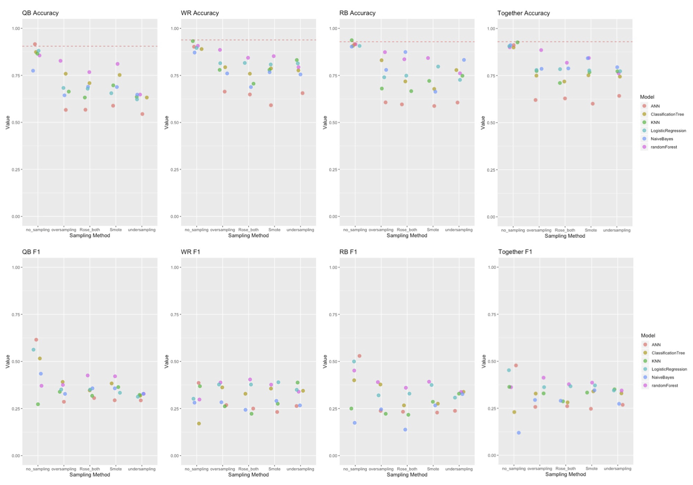

## The goal of our performance measurement
After training a model it is important to check how well it performes. Since we not only trained one model but 120 in total (6 algos * 5 samplings * 4 positions), it is even more important to compare all the different models to see which one is the best. For our business case, this means that we want to see which combination of method and sampling we should take to predict which position, or if we even have a model, which does it better when we leave them together.

## How to compare the method/sampling combinations for all positions
After training the models with 10-fold cross-validation, we applied them on all the (unsampled) data from 2007 to 2013 to obtain the true positives, true negatives, false positives and false negatives on the training set. At the end of every model-script, we save this information separately, to bring it all together in the script 'PerformanceMeasurement.R'. At the same time (and in the same scripts) we also compute the testing fit on the 2014 testing data.

The first step, is to bring them all into one dataframe, to use them easier. Then we make sure, that we used the same, unsampled data by computing the sums of TP, TN, FP, FN, for every method/sampling/position combination. In the CheckTibble we now see, that for every position the whole column contains always the same number, which means this is the case.

Then we calculate the Accuracy, Precision, Recall and the F1 score:

$$\text{Accuracy} = \frac{\text{Correct Classifications}}{\text{All Classifications}} = \frac{TP + TN}{TP+TN+FP+FN}$$
$$\text{Precision (Positice Perdictive Value)} = \frac{TP}{TP+FP}$$
$$\text{Recall (Sensitivity)} = \frac{TP}{TP+FN}$$
$$\text{F1 score (harmonic mean of precision and recall)}= 2*\frac{Precision * Recall}{Precision + Recall}$$

The result is a table showing the Accuracy, Precision, Recall and F1 scores for all the 120 model/sampling/position combination. We decided to us the F1 score as the model estimator, because is more sensitive to the inequality of availability of drafted vs. undrafted players in the target value. Therefore we just visualize the F1 score and the accuracy of all the models for the testing set. This table is quite big, but it is still interesting to have a look at it, to see how well which combination performes.

\newpage

```{r echo=FALSE, include=FALSE}
library(tidyverse)
load("../PerformanceMeasurement/BestModels14.Rdata")
load("../PerformanceMeasurement/PerfMeasAllModels14.Rdata")
PerfMeasTibble14_F1 = PerfMeasTibble14 %>%
  select("Method","Sampling","QB_F1", "WR_F1", "RB_F1", "Together_F1")
PerfMeasTibble14_Acc = PerfMeasTibble14 %>%
  select("Method","Sampling","QB_Acc", "WR_Acc", "RB_Acc", "Together_Acc")
```
```{r echo = FALSE}
knitr::kable(PerfMeasTibble14_F1, caption = "F1 score by Model/Position and Sampling on 2014 unsampled testing data", digits=4)
knitr::kable(PerfMeasTibble14_Acc, caption = "Accuracy by Model/Position and Sampling on 2014 unsampled testing data", digits=4)
```

We can see these two tendencies in the models:

* Mostly better performance with unsampled data, than with sampled data
* Mostly better performance when we split the positions manually

The four following plots combine the information of both tibbles, showing the accuracy and the F1 score on every sampling method for every position on its own. The horizontal lines show the no information rates for the accuracy, which displays, how a model's performance would be when predicting only 0's.

\newsection

{#id .class width=80% heigth=50%}

## Our best models
Now let's have a look at the best model/sampling combination for every position:

```{r echo = FALSE}
knitr::kable(ResultTibble14, caption = "The best model/sampling combinations by position", digits=4)
```

As we see, measured at the F1-score, the atrificial neural networks perform best for QB's, RB's and all positions together. For the WR's it is the rose-both-sampled data trained random forest.


## Discussion
Our models with accuracies up to 91.8% seem to be very good at the first sight. But we have to keep the reason for filtering out the players with <10 played games and sampling the data in mind. Here we applied the models to the unsampled but filtered data of 2014, which only contains 7.01% of drafted players. This means, that a model predicting "not drafted" for every player would still perform better, since it would still have an accuracy of 92.99% on the whole data set (='Together'). In other words, our models all perform unter the 'no information rate', which makes them not really good.

Interpretations of models are always quite difficult, but the following thoughts are pretty likely to be true, according to the TP/TN/FP/FN. Our models are okay at predicting the likelihood of players being drafted that didn't perform very well in college football being low. It probably also does not too bad in predicting great players to be drafted, that nearly must be picked (and probably are picked early in the draft). But there must be much room for improvement for all the players that still performed well in college, and might or might not be drafted. Again in other words, the models can predict the more or less obvious drafts and non-drafts but is not really better than random for the intresting cases.

We would like to close the circle to one of our fist lessons in machine learning, in which we were taught the following very high level formula for models (the right part). Y denotes the true outcome (in our case whether a player is drafted or not), f(X) is the true pattern that describes it, and $\epsilon$ is the noise, which appears to be random. With our models (the left part) we try to predict a $\hat{Y}$, which shall be as close as possible to the true Y.

$$\hat{f}(X) = \hat{Y} \approx Y = f(X) + \varepsilon$$

Looking at this inequation we can think of three possibilities, why our models make so many mistakes:

* Our models $\hat{f_i}(X)$ do not include enough variables and/or are not sophisticated enough
* The data is not good enough
* The NFL draft contains a pretty large $\varepsilon$

Variables that are certainly missing in the model, are the ones that are not quantifyable easily, such as game intelligence, strenght of the own team, strenght of the opponents, maturity of the player and negative factors such as criminality, drug consumation and other negative behaviours. In the past, it happened again and again, that players with great game statistics and a great game intelligence, which were expected to be drafted in the first round fell far behind or were not drafted at all, because pictures of them consuming marihuana were published. 
