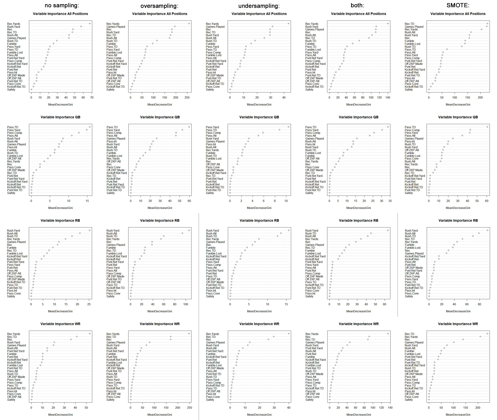

**Corresponding R Script:** [RF](https://github.com/NicSchuler/DSF_NFLDraftPrediction/blob/master/Project_Scripts/RandomForest.R)

# 1. Introduction

The goal of this project is to make a prediction about the likelilhood of College Football (CFB) players to be drafted into the professional football league (NFL). In order to achieve this, different aspects of a CFB player's college career are being used as features $p_{1}, ..., p_{n}$. These include game statistics such as rush attempts `Rush.Att` or yards ran after a pass `Pass.Yard`. To solve this problem, one of the methods employed is a random forest classifier (RF). RF is an ensemble learning method (a method comprised of different methods) that constructs multiple small decision trees that are ineffective on their own but exceedingly effective when combining the individual trees to output the class which is the mode of all individually predicted classes. Through this process of combining individually "useless" trees into a "forest", this model is very effective in combatting overfitting the training set (i.e. learning very specific patterns in the training data and therefore showing low bias but high variance) which is prevalent in regular decision tree models.

# 2. Bootstrap aggregation and feature bagging

In order to build the individual decision trees within the RF model, bootstrap aggregation (bagging) is conducted. This process assembles individual sample bags $X_{b}$ and labels $Y_{b}$ of training data through drawing randomly with replacement from the entire pool of training data $x_{1},...,x_{n}$ with the corresponding labels $y_{1},...,y_{n}$. For every one of these bags $b=1,...,B$, a classification (or regression) decision tree $f_{b}$ is fitted and subsequently the majority vote is used in classification problems or averaged over all bags $b$ in regression problems:

$$\hat{f}=\frac{1}{B}\sum_{b=1}^{B} f_{b}(X_{b})$$
This process of using many smaller and "less intelligent" trees in combination reduces variance by prohibiting one single tree of fitting the entire training set too closely. This would come at the cost of a higher bias when simply training many smaller trees on correlated samples of training data. Because the bags are assembled randomly with replacement, bootstrapping de-correlates the individual bags which in turn allows the RF model to reduce variance without increasing bias.

The second measure to enhance RF performance used on top of bootstrapping is sample bagging. Through the random selection of a subset of features to train on for every tree in the model, correlation between the trees is further reduced. If certain features are very strong predictors of the ouput, using them on all sub-trees would correlate them and therefore yield a higher bias. In the script, the default value of features for classification $\sqrt{p}$ is passed as the `mtry` argument due to time constraints of this project and the increase of computing time associated with extended tuning, however the optimal number depends on the training data and should therefore be treated as a tuning parameter in the future.

# 3. Data Standardization

Because the goal of RF is to obtain a set of partition rules to make a classification decision, it is not sensitive to differently scaled or centered features and therefore does not change depending on monotonic transformation of the input data. This means that there is no need to standardize the data used, event though it is differently scaled across features (see [RM_DataHandling](https://github.com/NicSchuler/DSF_NFLDraftPrediction/tree/master/Data/READMEs))

# 4. Tuning the model

In this project 10-fold cross validation was used to determine the optimal number of trees (`ntree`) to use in the RF model. For every position (`QB`, `RB`, `WR` and `all`), 10 folds of training data were fitted to an iteration of the RF model and its performance was tested. In the R script this is realized in the `perfFun(x)` function:

```{r eval=FALSE}
perfFun <- function(TP, FP, TN, FN){
  accuracy <- (TP + TN)/(TP + FP + TN + FN)
  precision <- TP/(TP + FP)
  recall <- TP/(TP + FN)
  F1 <- 2*((precision*recall)/(precision + recall))
  out <- data.frame("Accuracy" = accuracy, "Precision" = precision, "Recall" = recall, "F1" = F1)
  return(out)
}
```

To limit computation time, only 10 intervals of 100 trees were tested, which leaves the possibility of better performance when testing on a more granular level. As discussed above, an additional parameter to tune would be the number of features used in the feature bagging process.

# 5. Implementation in R

The application of RF in R is explained below. All code is included in the [RF script](https://github.com/NicSchuler/DSF_NFLDraftPrediction/blob/master/Project_Scripts/RandomForest.R) and step-by-step comments are provided.

## 5.1 Training the RF Model

For training the data from years 2007 to 2013 of all unsampled and sampled datasets are used respectively. The RF model is built and trained using the `randomForest` package. As previouly described, the model is tuned for the optimal number of trees to use, which is passed as the `ntrees` parameter to the `ntree = ` argument.

```{r eval=FALSE}
RF_QB <- randomForest(y ~ ., data = x, ntree = ntrees)
```
To make predictions for the testing data, the `predict.randomForest` function is used. For the probability cutoff value 0.5 is used by default. Because the project works with classification, this value is the fraction of votes for one of the classes, so a cutoff of 0.5 can be understood as a majority vote by the different features.

```{r eval=FALSE}
pred <- as.integer(as.vector(predict(RF_QB, x_test)))
```
 
## 5.2 Variable Importance

The RF model can be used to determine variable importance. To achieve this, a RF is fitted to the data, features are subsequently perturbated individually and the change in average out-of-bag (OOB) error is compared among the features. The resulting comparison allows for statements about the variable importance (i.e. the feature yielding the biggest difference in OOB error having the greatest impact). To visualize variable importance in this project, the Mean Decrease in Gini for all features was plotted for all positions and all sampling methods. Higher Mean Decrease in Gini indicates higher variable importance.



Because the datasets do not include categorical variables with multiple levels, variable importance is not biased towards features with more levels. To gain advanced insight into the variable importance of the prediction, further analysis is needed and error inducing factors such as correlation in features should be explored, which exceed the scope of this project.

## 5.3 Model Performance

In order to gain an oversight of the model performance, the cross validated models are tested on their training and testing (using the year 2014) fit for all positions and all sampling methods. Both are based on unsampled data, allowing for the model's predictive ability on imbalanced class sizes, as they occur in the underlying business case, to be analyzed. The training and testing data performance can be viewed below (also see the [between model comparison](https://github.com/NicSchuler/DSF_NFLDraftPrediction/blob/master/Data/READMEs/RM_PerformanceMeasurement.pdf)):

```{r, include=FALSE}
library(tidyverse)
load("../PerformanceMeasurement/randomForestPerfMeas.Rdata")
randomForestPerfMeas1 = randomForestPerfMeas %>%
  select(-c(Method, Sampling))
PerfMeas = as.data.frame(t(randomForestPerfMeas1))
names(PerfMeas) = c("No Sampling", "Oversampling", "Undersampling", "Rose Both", "Smote")
load("../PerformanceMeasurement/randomForestPerfMeas2014.Rdata")
randomForestPerfMeas2014_1 = randomForestPerfMeas2014 %>%
  select(-c(Method, Sampling))
PerfMeas2014 = as.data.frame(t(randomForestPerfMeas2014_1))
names(PerfMeas2014) = c("No Sampling", "Oversampling", "Undersampling", "Rose Both", "Smote")
```
```{r echo = FALSE}
knitr::kable(PerfMeas, caption = "training data performance")
knitr::kable(PerfMeas2014, caption = "testing data performance")
```